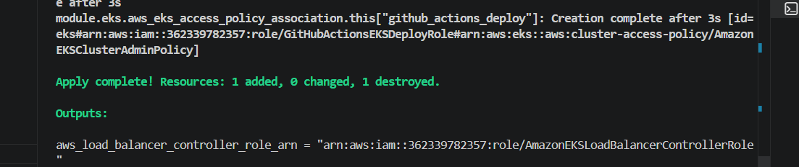
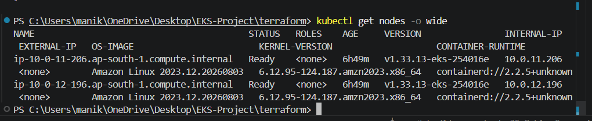
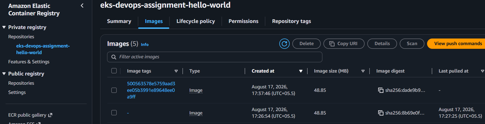
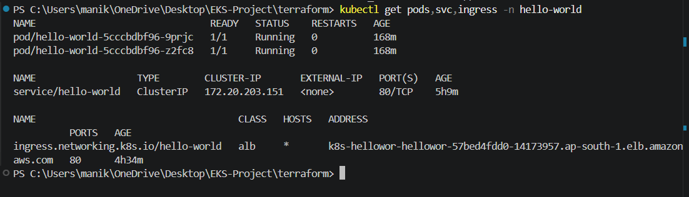
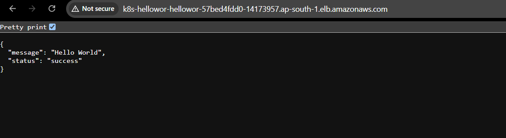
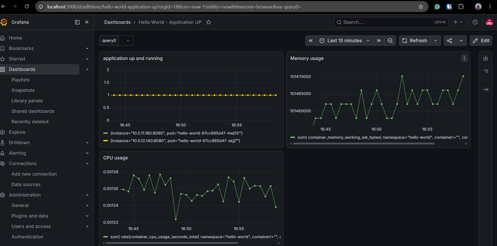
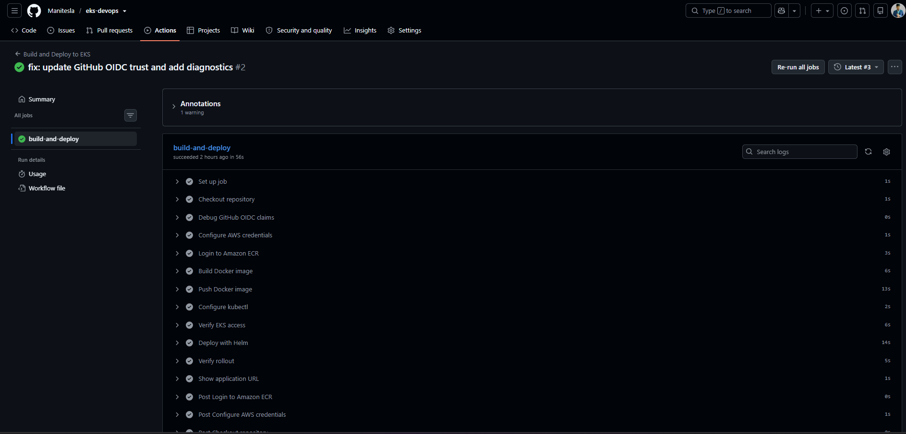
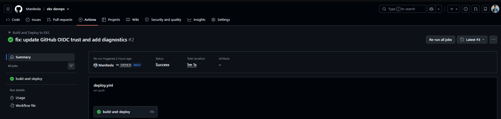

# AWS EKS DevOps Take-Home Assignment

## End-to-End Kubernetes Deployment using Terraform, Docker, Helm, GitHub Actions, Prometheus and Grafana

This project demonstrates a complete DevOps workflow for provisioning infrastructure, deploying a containerized application, exposing it publicly, monitoring it, and automating deployments using CI/CD.

The project uses:

* **Terraform** – AWS infrastructure provisioning
* **Amazon EKS** – Kubernetes cluster
* **Amazon ECR** – Docker image registry
* **Docker** – Application containerization
* **Helm** – Kubernetes application deployment
* **AWS Load Balancer Controller** – ALB provisioning
* **Prometheus** – Metrics collection
* **Grafana** – Monitoring dashboards
* **GitHub Actions** – CI/CD
* **GitHub OIDC** – Secure AWS authentication

---

# 1. Architecture

```text
Developer
   |
   v
GitHub Repository
   |
   v
GitHub Actions
   |
   | OIDC
   v
AWS IAM / STS
   |
   +-------------------------+
   |                         |
   v                         v
Amazon ECR               Amazon EKS
   |                         |
Docker Images                |
                             v
                       Helm Deployment
                             |
                             v
                      Kubernetes Service
                             |
                             v
                    Kubernetes Ingress
                             |
                             v
               AWS Load Balancer Controller
                             |
                             v
                 Application Load Balancer
                             |
                             v
                          Internet
```

Monitoring flow:

```text
Hello World Application
        |
        | /metrics
        v
   ServiceMonitor
        |
        v
    Prometheus
        |
        v
      Grafana
```

---

# 2. Technology Stack

| Component              | Technology     |
| ---------------------- | -------------- |
| Cloud                  | AWS            |
| Infrastructure as Code | Terraform      |
| Kubernetes             | Amazon EKS     |
| Containerization       | Docker         |
| Container Registry     | Amazon ECR     |
| Deployment             | Helm           |
| Load Balancer          | AWS ALB        |
| CI/CD                  | GitHub Actions |
| AWS Authentication     | GitHub OIDC    |
| Monitoring             | Prometheus     |
| Visualization          | Grafana        |

---

# 3. Repository Structure

```text
eks-devops/
│
├── app/
│   ├── app.py
│   ├── requirements.txt
│   ├── Dockerfile
│   └── .dockerignore
│
├── terraform/
│   ├── providers.tf
│   ├── variables.tf
│   ├── vpc.tf
│   ├── eks.tf
│   ├── ecr.tf
│   ├── alb-controller.tf
│   ├── github-oidc.tf
│   ├── github-actions-policy.tf
│   └── outputs.tf
│
├── helm/
│   └── hello-world/
│       ├── Chart.yaml
│       ├── values.yaml
│       └── templates/
│           ├── deployment.yaml
│           ├── service.yaml
│           ├── ingress.yaml
│           ├── servicemonitor.yaml
│           └── _helpers.tpl
│
├── .github/
│   └── workflows/
│       └── deploy.yml
│
├── images/
│   ├── application-kubernetes.png
│   ├── ecrrepo.png
│   ├── eksnodesready.png
│   ├── githubaction2.png
│   ├── github-actions.png
│   ├── grafana.png
│   ├── helloworld.png
│   ├── prometheus.png
│   └── terraformapply.png
│
└── README.md
```

---

# 4. Prerequisites

Install the following tools before starting:

* AWS CLI
* Terraform
* Docker
* kubectl
* Helm
* Git
* GitHub account
* AWS account

Verify installations:

```powershell
aws --version
terraform --version
docker --version
kubectl version --client
helm version
git --version
```

Configure AWS CLI:

```powershell
aws configure
```

Configure:

```text
AWS Access Key ID
AWS Secret Access Key
Default region: ap-south-1
Output format: json
```

Verify AWS access:

```powershell
aws sts get-caller-identity
```

---

# 5. Clone the Repository

```powershell
git clone https://github.com/Manitesla/eks-devops.git
cd eks-devops
```

---

# 6. Application

The application exposes three endpoints:

| Endpoint   | Purpose             |
| ---------- | ------------------- |
| `/`        | Returns Hello World |
| `/health`  | Health check        |
| `/metrics` | Prometheus metrics  |

The application runs on:

```text
Port 8080
```

The `/health` endpoint is used by Kubernetes and the AWS ALB.

The `/metrics` endpoint exposes:

```text
hello_world_requests_total
```

which increases whenever the application receives traffic.

---

# 7. Test Application Locally

Navigate to the application directory:

```powershell
cd app
```

Create Python environment:

```powershell
python -m venv venv
```

Activate:

```powershell
.\venv\Scripts\activate
```

Install dependencies:

```powershell
pip install -r requirements.txt
```

Run:

```powershell
python app.py
```

Test:

```powershell
curl.exe http://localhost:8080
```

Health check:

```powershell
curl.exe http://localhost:8080/health
```

Metrics:

```powershell
curl.exe http://localhost:8080/metrics
```

---

# 8. Docker Build

Build the application image:

```powershell
docker build -t hello-world:1.0 .
```

Run locally:

```powershell
docker run -d --name hello-world -p 8080:8080 hello-world:1.0
```

Verify:

```powershell
docker ps
```

Test:

```powershell
curl.exe http://localhost:8080
```

Stop and remove:

```powershell
docker stop hello-world
docker rm hello-world
```

Return to project root:

```powershell
cd ..
```

---

# 9. Provision AWS Infrastructure using Terraform

Navigate to Terraform:

```powershell
cd terraform
```

Initialize Terraform:

```powershell
terraform init
```

Format configuration:

```powershell
terraform fmt
```

Validate:

```powershell
terraform validate
```

Create plan:

```powershell
terraform plan
```

Review the plan carefully before applying.

Apply:

```powershell
terraform apply
```

Type:

```text
yes
```

Terraform creates:

* VPC
* Public and private subnets
* EKS cluster
* Managed node group
* EKS add-ons
* ECR repository
* IAM roles
* GitHub OIDC provider
* Load Balancer Controller IAM permissions

### Terraform Apply



---

# 10. Configure kubectl for EKS

The cluster name used in this project is:

```text
eks
```

Configure kubeconfig:

```powershell
aws eks update-kubeconfig `
  --region ap-south-1 `
  --name eks
```

Verify cluster:

```powershell
kubectl cluster-info
```

Check nodes:

```powershell
kubectl get nodes
```

Both worker nodes should show:

```text
Ready
```

### EKS Nodes



---

# 11. Verify EKS System Components

Check system pods:

```powershell
kubectl get pods -n kube-system
```

Important components should be running:

```text
aws-node
coredns
kube-proxy
```

The following EKS add-ons are managed using Terraform:

```text
vpc-cni
kube-proxy
coredns
```

---

# 12. Push Docker Image to Amazon ECR

Get the repository URL:

```powershell
terraform output -raw ecr_repository_url
```

Return to project root:

```powershell
cd ..
```

Set account ID:

```powershell
$AWS_ACCOUNT_ID = aws sts get-caller-identity --query Account --output text
```

Set registry:

```powershell
$ECR_REGISTRY = "$AWS_ACCOUNT_ID.dkr.ecr.ap-south-1.amazonaws.com"
```

Login to ECR:

```powershell
aws ecr get-login-password --region ap-south-1 |
docker login --username AWS --password-stdin $ECR_REGISTRY
```

Set repository:

```powershell
$ECR_REPO = "$ECR_REGISTRY/eks-devops-assignment-hello-world"
```

Tag image:

```powershell
docker tag hello-world:1.0 "${ECR_REPO}:1.0"
```

Push:

```powershell
docker push "${ECR_REPO}:1.0"
```

Verify:

```powershell
aws ecr list-images `
  --repository-name eks-devops-assignment-hello-world `
  --region ap-south-1
```

### ECR Repository



---

# 13. Deploy Application using Helm

Navigate to Helm:

```powershell
cd helm
```

Validate the chart:

```powershell
helm lint .\hello-world
```

Render Kubernetes manifests:

```powershell
helm template hello-world .\hello-world
```

Create namespace:

```powershell
kubectl create namespace hello-world
```

Deploy:

```powershell
helm upgrade --install hello-world .\hello-world `
  --namespace hello-world
```

Verify Helm release:

```powershell
helm list -n hello-world
```

---

# 14. Verify Kubernetes Application

Check pods:

```powershell
kubectl get pods -n hello-world
```

Check deployment:

```powershell
kubectl get deployment -n hello-world
```

Check service:

```powershell
kubectl get svc -n hello-world
```

Check everything together:

```powershell
kubectl get pods,svc,ingress -n hello-world
```

### Kubernetes Application



---

# 15. Test Application Before ALB

Use port forwarding:

```powershell
kubectl port-forward service/hello-world 8080:80 -n hello-world
```

Open another terminal.

Test:

```powershell
curl.exe http://localhost:8080
```

Health:

```powershell
curl.exe http://localhost:8080/health
```

Metrics:

```powershell
curl.exe http://localhost:8080/metrics
```

---

# 16. AWS Load Balancer Controller

The AWS Load Balancer Controller IAM role is created using Terraform.

Add the official EKS Helm repository:

```powershell
helm repo add eks https://aws.github.io/eks-charts
```

Update Helm repositories:

```powershell
helm repo update
```

Get the VPC ID:

```powershell
$VPC_ID = aws eks describe-cluster `
  --name eks `
  --region ap-south-1 `
  --query "cluster.resourcesVpcConfig.vpcId" `
  --output text
```

Create the ServiceAccount if required:

```powershell
kubectl create serviceaccount aws-load-balancer-controller `
  -n kube-system
```

Associate the IAM role:

```powershell
kubectl annotate serviceaccount aws-load-balancer-controller `
  -n kube-system `
  eks.amazonaws.com/role-arn=arn:aws:iam::<AWS_ACCOUNT_ID>:role/AmazonEKSLoadBalancerControllerRole `
  --overwrite
```

Install controller:

```powershell
helm upgrade --install aws-load-balancer-controller eks/aws-load-balancer-controller `
  --namespace kube-system `
  --set clusterName=eks `
  --set region=ap-south-1 `
  --set vpcId="$VPC_ID" `
  --set serviceAccount.create=false `
  --set serviceAccount.name=aws-load-balancer-controller
```

Verify:

```powershell
kubectl get deployment aws-load-balancer-controller -n kube-system
```

Expected:

```text
READY 2/2
```

---

# 17. Create AWS ALB using Ingress

The Helm chart already contains:

```text
templates/ingress.yaml
```

Upgrade application:

```powershell
helm upgrade hello-world .\hello-world `
  --namespace hello-world
```

Check ingress:

```powershell
kubectl get ingress -n hello-world
```

Wait until an ALB hostname appears under:

```text
ADDRESS
```

Retrieve hostname:

```powershell
$ALB = kubectl get ingress hello-world `
  -n hello-world `
  -o jsonpath="{.status.loadBalancer.ingress[0].hostname}"
```

Display:

```powershell
$ALB
```

Test application:

```powershell
curl.exe "http://${ALB}/"
```

Health:

```powershell
curl.exe "http://${ALB}/health"
```

### Public Application



---

# 18. Install Prometheus and Grafana

Add Prometheus Helm repository:

```powershell
helm repo add prometheus-community https://prometheus-community.github.io/helm-charts
```

Update:

```powershell
helm repo update
```

Create monitoring namespace:

```powershell
kubectl create namespace monitoring
```

Install monitoring stack:

```powershell
helm upgrade --install monitoring prometheus-community/kube-prometheus-stack `
  --namespace monitoring
```

Verify:

```powershell
kubectl get pods -n monitoring
```

Important components include:

```text
Prometheus
Grafana
Alertmanager
kube-state-metrics
node-exporter
Prometheus Operator
```

---

# 19. ServiceMonitor

The application Helm chart contains:

```text
templates/servicemonitor.yaml
```

The ServiceMonitor tells Prometheus to scrape:

```text
/metrics
```

Verify:

```powershell
kubectl get servicemonitor -n hello-world
```

Expected:

```text
hello-world
```

---

# 20. Verify Prometheus

Port-forward Prometheus:

```powershell
kubectl port-forward `
  service/monitoring-kube-prometheus-prometheus `
  9090:9090 `
  -n monitoring
```

Open:

```text
http://localhost:9090
```

Query:

```promql
hello_world_requests_total
```

Generate traffic:

```powershell
1..20 | ForEach-Object {
    curl.exe -s "http://${ALB}/" | Out-Null
}
```

Run the query again.

The counter should increase.

### Prometheus


---

# 21. Grafana

Get Grafana password:

```powershell
$PASS = kubectl get secret monitoring-grafana `
  -n monitoring `
  -o jsonpath="{.data.admin-password}"
```

Decode:

```powershell
[System.Text.Encoding]::UTF8.GetString(
  [System.Convert]::FromBase64String($PASS)
)
```

Username:

```text
admin
```

Port-forward Grafana:

```powershell
kubectl port-forward `
  service/monitoring-grafana `
  3000:80 `
  -n monitoring
```

Open:

```text
http://localhost:3000
```

---

# 22. Grafana Application Dashboard

The custom dashboard contains the following panels.

## Requests Per Second

```promql
sum(rate(hello_world_requests_total[1m]))
```

## Application Availability

```promql
up{namespace="hello-world"}
```

## CPU Usage

```promql
sum(
  rate(container_cpu_usage_seconds_total{
    namespace="hello-world",
    container!="",
    container!="POD"
  }[5m])
)
```

## Memory Usage

```promql
sum(
  container_memory_working_set_bytes{
    namespace="hello-world",
    container!="",
    container!="POD"
  }
)
```

### Grafana Dashboard



---

# 23. GitHub OIDC Authentication

GitHub Actions authenticates to AWS using OpenID Connect.

No permanent AWS Access Key or Secret Access Key is stored in GitHub.

Flow:

```text
GitHub Actions
       |
       v
OIDC Token
       |
       v
AWS IAM OIDC Provider
       |
       v
AWS STS
       |
       v
Temporary AWS Credentials
```

The repo used is:

```text
Manitesla/eks-devops
```

Terraform creates:

* GitHub OIDC provider
* GitHub Actions IAM role
* ECR permissions
* EKS permissions
* EKS access entry

---

# 24. GitHub Actions EKS Access

The GitHub Actions IAM role is registered with the EKS cluster.

The project currently uses:

```text
AmazonEKSClusterAdminPolicy
```

This allows Helm to manage:

* Deployment
* Service
* Ingress
* ServiceMonitor
* Other required Kubernetes resources

For production environments this should be replaced with least-privilege Kubernetes RBAC.

---

# 25. GitHub Actions CI/CD Pipeline

The workflow is located at:

```text
.github/workflows/deploy.yml
```

Pipeline flow:

```text
Git Push
   |
   v
Checkout Repository
   |
   v
GitHub OIDC Authentication
   |
   v
AWS Temporary Credentials
   |
   v
Login to Amazon ECR
   |
   v
Build Docker Image
   |
   v
Tag Image using Git SHA
   |
   v
Push Image to ECR
   |
   v
Configure kubectl
   |
   v
Connect to EKS
   |
   v
Helm Upgrade
   |
   v
Verify Kubernetes Rollout
```

Every image is tagged using:

```text
github.sha
```

which provides traceability between source code and deployed image.

---

# 26. Trigger the Pipeline

Commit application changes:

```powershell
git add .
```

Commit:

```powershell
git commit -m "update application"
```

Push:

```powershell
git push origin main
```

Open:

```text
GitHub Repository
→ Actions
→ Build and Deploy to EKS
```

Verify all pipeline stages are green.

### GitHub Actions



### Deployment Verification



---

# 27. Final Verification

Check nodes:

```powershell
kubectl get nodes
```

Check application:

```powershell
kubectl get pods -n hello-world
```

Check services:

```powershell
kubectl get svc -n hello-world
```

Check ingress:

```powershell
kubectl get ingress -n hello-world
```

Check monitoring:

```powershell
kubectl get pods -n monitoring
```

Check ServiceMonitor:

```powershell
kubectl get servicemonitor -n hello-world
```

Check Load Balancer Controller:

```powershell
kubectl get pods -n kube-system |
Select-String "load-balancer"
```

Check Helm:

```powershell
helm list -n hello-world
```

---

# 28. End-to-End Deployment Flow

```text
Developer
    |
    v
Git Push
    |
    v
GitHub Actions
    |
    v
OIDC Authentication
    |
    v
Docker Build
    |
    v
Amazon ECR
    |
    v
Amazon EKS
    |
    v
Helm Deployment
    |
    v
Kubernetes Pods
    |
    v
AWS ALB
    |
    v
User
```

Monitoring:

```text
Application
    |
    v
/metrics
    |
    v
ServiceMonitor
    |
    v
Prometheus
    |
    v
Grafana
```

---

# 29. Issues Faced and Resolutions

## EKS Nodes Were Unhealthy

**Issue:**
The EKS managed node group failed with `NodeCreationFailure: Unhealthy nodes in the kubernetes cluster`.

**Resolution:**
The `vpc-cni`, `kube-proxy`, and `coredns` EKS add-ons were installed and later managed through Terraform. The nodes then successfully joined the cluster and became `Ready`.

---

## Terraform Tried to Recreate EKS Add-ons

**Issue:**
The add-ons were initially created manually and Terraform attempted to create them again.

**Resolution:**
The existing EKS add-ons were imported into Terraform state. Terraform then recognized and managed the existing resources correctly.

---

## Docker ECR Login Failed

**Issue:**
Docker authentication from PowerShell returned `400 Bad Request`.

**Resolution:**
The ECR registry endpoint and AWS authentication were verified. Login succeeded using the working shell environment and the image was successfully pushed to ECR.

---

## Helm Command Was Not Recognized

**Issue:**
PowerShell could not locate the Helm executable.

**Resolution:**
The Helm installation directory was added to the Windows PATH and verified using `helm version`.

---

## Helm Lint Failed

**Issue:**
The default generated Helm chart referenced unused `httpRoute` values and failed validation.

**Resolution:**
Unused generated templates were removed and the chart was simplified to contain only Deployment, Service, Ingress and ServiceMonitor.

---

## AWS Load Balancer Controller CrashLoopBackOff

**Issue:**
The controller failed to determine the VPC ID using EC2 instance metadata.

**Resolution:**
The AWS region and VPC ID were explicitly provided to the Helm deployment. The controller then initialized successfully.

---

## Load Balancer Controller ServiceAccount Missing

**Issue:**
The controller ReplicaSet could not create pods because the required ServiceAccount did not exist.

**Resolution:**
The ServiceAccount was created and associated with the controller IAM role. The deployment was restarted and both replicas became healthy.

---

## ALB DNS Initially Failed

**Issue:**
The browser initially returned `DNS_PROBE_FINISHED_NXDOMAIN`.

**Resolution:**
The hostname was retrieved directly from the Kubernetes Ingress and AWS DNS provisioning was allowed to complete. The application then became publicly accessible.

---

## ServiceMonitor Helm Configuration Error

**Issue:**
The Helm template failed because `serviceMonitor.enabled` was not present in `values.yaml`.

**Resolution:**
The missing ServiceMonitor configuration was added and the chart was upgraded successfully.

---

## GitHub OIDC Authentication Failed

**Issue:**
GitHub Actions returned:

```text
Not authorized to perform sts:AssumeRoleWithWebIdentity
```

**Resolution:**
The actual GitHub OIDC claims were inspected. The IAM trust policy was updated to match the real immutable GitHub OIDC subject.

---

## GitHub Actions Could Not Manage ServiceMonitor

**Issue:**
Helm returned:

```text
servicemonitors.monitoring.coreos.com is forbidden
```

**Resolution:**
The namespace-scoped EKS edit policy did not include the Prometheus custom resource. For this assignment, the GitHub Actions role was granted `AmazonEKSClusterAdminPolicy`.

---

# 30. Security Considerations

Implemented security practices:

* GitHub OIDC instead of static AWS credentials
* IAM role-based AWS authentication
* EKS worker nodes in private subnets
* ECR image scanning
* Git SHA image versioning
* Infrastructure managed through Terraform
* Kubernetes health probes
* Application resource limits

Production improvements:

* Least-privilege RBAC
* HTTPS with ACM
* Route 53 domain
* AWS WAF
* Secrets Manager
* NetworkPolicies
* Trivy container scanning
* Terraform remote state
* Separate Dev / Stage / Prod environments

---

# 31. Cleanup

To prevent unnecessary AWS cost, destroy the environment when it is no longer required.

Remove application:

```powershell
helm uninstall hello-world -n hello-world
```

Remove monitoring if required:

```powershell
helm uninstall monitoring -n monitoring
```

Navigate to Terraform:

```powershell
cd terraform
```

Review destruction:

```powershell
terraform plan -destroy
```

Destroy infrastructure:

```powershell
terraform destroy
```

Review the resources carefully before typing:

```text
yes
```

---

# 32. Conclusion

This project implements a complete DevOps workflow:

```text
Terraform
   |
   v
AWS Infrastructure
   |
   v
Amazon EKS
   |
   v
Docker + ECR
   |
   v
Helm
   |
   v
AWS ALB
   |
   v
Application
```

with automated delivery:

```text
GitHub
   |
   v
GitHub Actions
   |
   v
OIDC
   |
   v
AWS
   |
   v
EKS Deployment
```

and observability:

```text
Application
   |
   v
Prometheus
   |
   v
Grafana
```

The final solution demonstrates **Infrastructure as Code, Kubernetes deployment, secure cloud authentication, CI/CD automation, container management, load balancing and observability** in a single end-to-end AWS EKS implementation.
